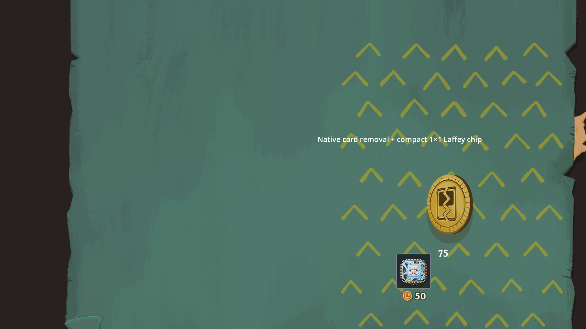

# 商店位置与装配光标

芯片商品相对删牌服务的位置从 `(-35, 255)` 调整为 `(-115, 220)`，即向左 80、向上 35 个布局单位。检查双方 0.65 普通缩放及 0.8 悬停缩放的组合，点击区域和删牌价格均不重叠；真实视口点击分别到达两项服务。

保留 `PatchworkMerchantEntry` 的空补货覆写与 `PurchasedShops` 售罄记录。通过实际官方送货员遗物、价格钩子和购买包装方法验证：50 金币商品享受送货员折扣后为 40，官方购买流程调用补货分支，但芯片仍售罄，第二次购买不扣款、不增加库存。无新增本地化说明。

`cursor_wrench.png` 为内置 image_gen 生成的透明扳手图片。2026-10-05 将柄部改为主要使用银白色金属，素材等比导出为 256×256；编辑提示词见 `wrench-cursor-silver-prompt.txt`，原生成记录保留在 `wrench-cursor-prompt.txt`。运行时从原 48 像素放大 70%，取整为最长边 82 像素；扳手上方钳口的热点同步乘以 1.7。底板使用 Arrow 形状，选中芯片且鼠标处于实际 10×10 格子区域时，通过官方 `NCursorManager.OverrideCursor` 切换；未选中、移出格子、取消、隐藏或退出场景时恢复官方光标。独立预览没有 NGame 时使用 Godot 光标接口。

右键取消仅清除本地选择及拖动预览，不提交网络动作、不修改存档状态。已安装芯片取消移动后显示原位置。按住左键拖动时右键取消，会抑制该次左键松开导致的库存按钮二次选择，随后正常鼠标与键盘操作继续生效。

验证使用真实官方光标管理器，覆盖默认光标、选中切换、移出／返回、库存预览取消、已安装芯片取消移动、拖动中取消、随后重新选择及隐藏／退出清理。现有拖放、遗物选择、保存点回滚与玩家独立状态检查仍通过。完整项目编译 0 警告、0 错误。

