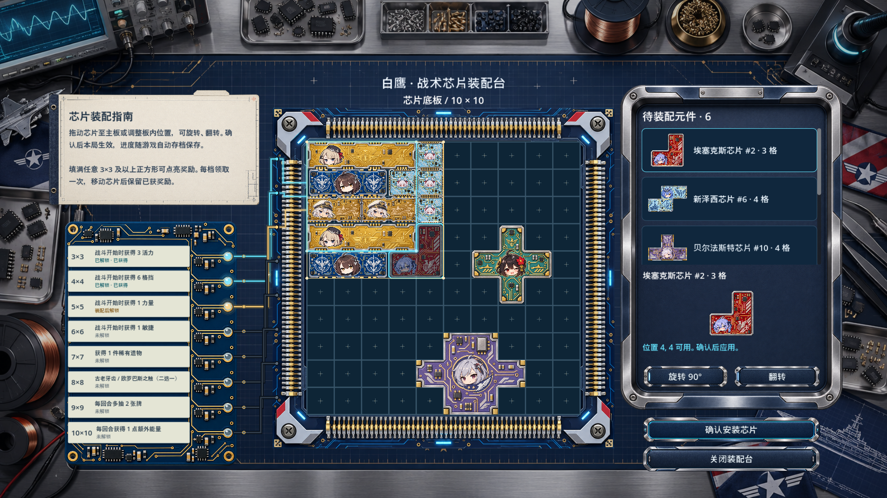

# 零件盘、8×8 遗物选择与保存

右侧元件列表、预览及旋转／翻转放在同一块金属零件盘内。底图以 2:3 等比显示，确认与关闭按钮位于盘外工作台。

8×8 奖励使用 amagichan 同样调用的官方 `RelicSelectCmd.FromChooseARelicScreen`，展示古老牙齿与欧罗巴斯之触。候选提前 `SetupForPlayer`，排除已持有的遗物。只剩一项时直接获得该项，两项都已有时不重复发放。取消选择不会放置芯片、扣除库存或领取奖励。选择期间关闭本玩家的装配台和地图，以便官方选择界面显示；完成或取消后恢复装配台。

装配台不调用 `SaveRun`。RitsuLib 的 `patchwork_board` 保持原存档结构和 SchemaVersion=1，使用 `WhenSet` 写入策略，确认只修改当前运行状态，随下一次官方保存写入。当前游戏程序集确认的保存调用位于进入地图节点、战斗结算及特定事件状态完成流程。具体保存时机由官方控制。

未到下一个保存点退出后，继续游戏恢复上一个正式保存快照中的库存、位置、奖励与商店购买记录。多人房间中途重连通过当前运行状态同步，保留尚未写盘的进度；各玩家按 NetId 独立保存。正式存档文件仍由官方 SaveManager 写入，不新增独立写盘或退出保存流程。

验证：完整项目 Rebuild 为 0 警告、0 错误；Godot 场景渲染及拖放／旋转／翻转检查通过。使用真实 RitsuLib 存档附件与官方选择同步器，检查两名玩家独立状态、旧快照冻结、退出回滚、下一快照保留、重连、遗物选择索引与取消。实际 8×8 执行器取消保持全部装配状态不变并释放玩家锁。未进行两台游戏客户端的在线联机实测。

## 操作按钮

四张独立底图为 `button_rotate.png`、`button_flip.png`、`button_confirm.png`、`button_close.png`，生成记录见 `assembly-button-prompts.json`。文字继续使用原有本地化键，不烘焙进图片。场景通过 AtlasTexture 排除透明留白，用 NinePatchRect 保留端部和边框，再统一缩放至按钮高度；中央空白区域适应按钮宽度。

确认和关闭按钮上移至零件盘下沿附近。操作按钮沿用 Godot Button 输入，图片忽略鼠标事件；正常、悬停、按下、禁用和键盘焦点均有反馈。旧内嵌 8×8 下拉框、选择参数与直接发放分支已移除，项目中只保留官方二选一流程及必要的遗物兼容处理。

验证记录增加 `PASS_BUTTONS`：真实鼠标悬停与按住／松开、禁用和键盘焦点，图片完整覆盖点击区域且边角等比缩放。拖放、奖励选择、检查点保存与玩家独立性检查仍通过。

